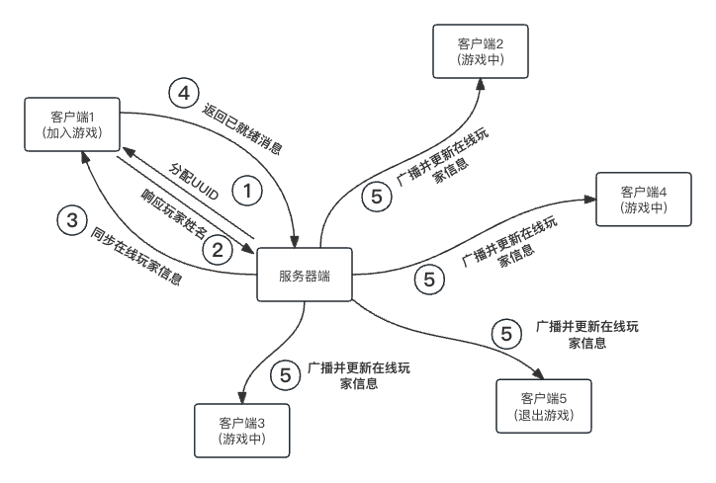
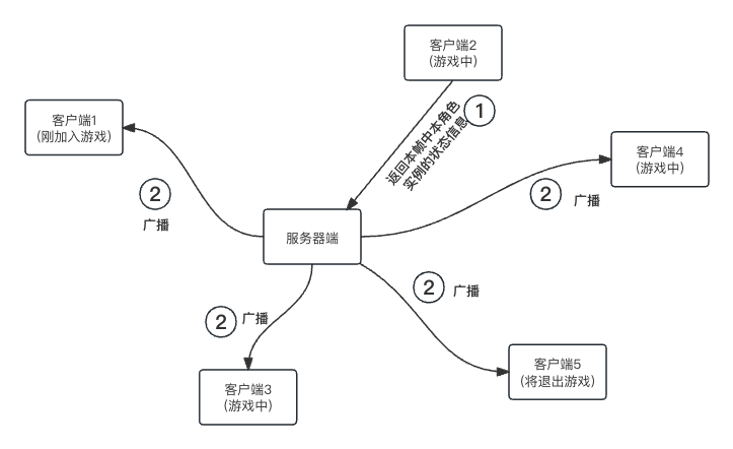
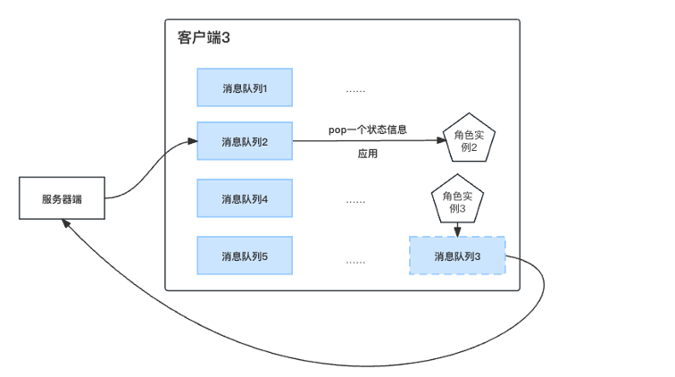
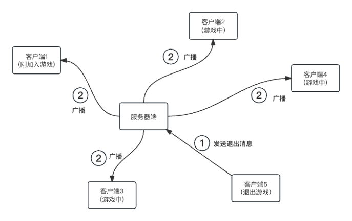
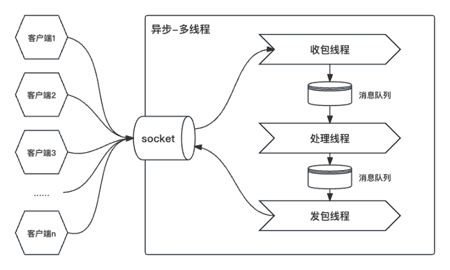
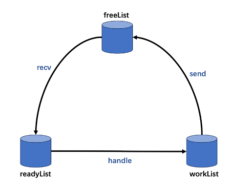

# epoll-server

a simple game server

> 注意：需要 epoll 系统调用，并没有为 drawin 上的 kqueue 或 windows 上的 IOCP 提供实现

- [epoll-server](#epoll-server)
  - [游戏介绍](#游戏介绍)
  - [关于服务器设计（软件）](#关于服务器设计软件)
    - [根据帧同步的消息交互和协议设计](#根据帧同步的消息交互和协议设计)
    - [新玩家加入游戏](#新玩家加入游戏)
    - [游戏中玩家角色状态信息同步](#游戏中玩家角色状态信息同步)
    - [玩家退出/掉线处理（半开连接-\>心跳包）](#玩家退出掉线处理半开连接-心跳包)
  - [服务器调度设计简介](#服务器调度设计简介)
    - [关于异步-固定多线程的简单代码实现](#关于异步-固定多线程的简单代码实现)

## 游戏介绍

游戏名称：Squash the Creeps 通过 Godot engine 3.5.3 制作：


Godot Engine 是一款开源的跨平台游戏引擎，具有图形化的场景编辑器和强大的脚本语言 GDScript。由于其免费、开源、轻量级和灵活的特性，Godot 已成为游戏开发者和创作者的热门选择。它支持 2D 和 3D 游戏开发，提供丰富的功能集，包括物理引擎、动画系统、网络功能等，使得开发者能够创建各种类型的游戏和交互性应用。

**同步方式**：**状态同步**

在游戏开发中，状态同步是一种重要的技术手段，用于确保所有玩家在不同设备上看到的游戏状态保持一致。在多人在线游戏中，玩家的操作和游戏世界的变化需要在多个客户端之间实时同步，以实现流畅的游戏体验。状态同步的核心在于将游戏对象的状态（如位置、速度、生命值等）从服务器发送到所有连接的客户端。服务器通常负责管理游戏的核心逻辑，所有重要的状态更新都在服务器上处理，然后将更新的信息广播给各个客户端。这种方式确保了游戏的公平性和一致性，因为客户端不能直接操控游戏状态，只能通过服务器进行交互。为了优化性能和减少网络延迟，状态同步常采用预测和插值技术，允许客户端在接收到更新之前先进行局部预测，从而提升游戏的流畅度和响应性。通过合理设计状态同步机制，开发者可以在保证游戏公平性的同时，提高玩家的沉浸感和互动体验。

## 关于服务器设计（软件）

> 硬件为树莓派 4b： `Linux raspberrypi 6.1.0-rpi6-rpi-v8 #1 SMP PREEMPT Debian 1:6.1.58-1+rpt2 (2023-10-27) aarch64 GNU/Linux`

### 根据帧同步的消息交互和协议设计

既然服务器端只设计到转发操作，那么我们首先应该把服务器的“操作消息”以及与之搭配的“消息协议”定义出来。考虑到网络传输的效率和性能，首选的协议类型当然是二进制协议。这里的二进制协议十分简单，就是一个包含了操作消息类型和操作消息长度的结构体：

```c
// include/binary_protocol.h
// 定义消息头
typedef struct
{
    MessageType type; // 消息类型
    uint16_t length;  // 消息长度
} MessageHeader;
```

消息类型 MessageType 是一个枚举类型：

```c
typedef enum
{
    UNKWON_TYPE = 1,    // 未知类型, 用于初始化
    RESPONSE_UUID,      // 响应UUID, 用于客户端初始化自己的UUID
    GLOBAL_PLAYER_INFO, // 全局玩家信息, 用于客户端初始化其他玩家的相关信息
    SOME_ONE_JOIN,      // 有玩家加入, 用于客户端初始化其他玩家的相关信息
    SOME_ONE_QUIT,      // 有玩家退出, 用于客户端初始化其他玩家的相关信息
    GAME_UPDATE,        // 游戏更新, 用于客户端更新游戏状态
    PLAYER_INFO_CERT,   // 玩家信息认证, 用于客户端向服务器端认证玩家信息
    CLIENT_READY        // 客户端准备就绪, 用于客户端通知服务器自己已经准备就绪
} MessageType;
```

这个消息头会最后会被放在一个字节数组之中和消息体一起被发送过去，我们不妨想想这个消息体之中应该会包含哪些消息：

1. 游戏角色实例的状态信息，用于在各个客户端之中对游戏角色进行同步，包含角色所处的 x、y、z 坐标以及在 x、y、z 坐标上的旋转角度。
2. 服务器端向客户端分配全局唯一 UUID 号。
3. 客户端向服务器端响应的玩家名称。
4. 服务器端向客户端响应的所有其他玩家的相关信息，包括所有在线玩家的 UUID 和名称，用于初始化游戏。
5. 服务器端向客户端更新的新加入的玩家的 UUID 和名称。
6. 客户端向服务端发送退出游戏消息。
7. 服务器端向其他客户端广播关于此玩家退出游戏的消息。
8. 玩家信息认证, 用于客户端向服务器端认证玩家信息。
9. 客户端准备就绪, 用于客户端通知服务器自己已经准备就绪。

这里实际上不需要同步玩家的死亡消息，因为如果一个玩家在自己的视角被其它玩家踩扁了，根据帧同步的理论，其他玩家都能看到这一过程发生，所以他们都会在自己的客户端上“让这个玩家死亡”。

服务器端和客户端之间的消息交流模型图大致如下：

### 新玩家加入游戏



当新玩家加入游戏时，首先服务器端 accept 到客户端的请求之后，会响应一个 UUID 给客户端，这个 UUID 会用来区分不同的游戏玩家，所以必须要是全局唯一的，这可以通过读 Linux 操作系统下的一个文件来实现：

```shell
cat /proc/sys/kernel/random/uuid
```

> 这个命令的作用是显示系统内核参数/proc/sys/kernel/random/uuid 的值。具体而言，它用于生成并输出一个随机的 UUID（通用唯一标识符）。UUID 是一个 128 位的标识符，通常以 32 个十六进制字符的形式表示

客户端收到 UUID 响应之后会把自己的玩家昵称返回给服务器端，这是因为服务器端会维护一个**在线玩家信息表**，其中包括了一个玩家的昵称，玩家的 UUID 以及对应的 socket 文件描述符等相关信息。客户端当然也会维护一个，所以我们要将服务器端已有的所有在线玩家的状态信息都同步给这个新加入的客户端。当客户端收到并同步所有在线玩家的信息时，这意味着它已经具备了创建所有游戏玩家实例、以及收发并同步游戏角色实例状态信息的能力，这个时候，它会向服务器端发送一个“已就绪”消息，通知服务器端这个客户端已经真实可用。此时服务器端会将这个玩家的相关信息加入到**在线玩家信息表**之中，并向其它可用的客户端更新此新加入的玩家的信息。

### 游戏中玩家角色状态信息同步



由于是状态同步游戏，玩家角色状态信息的同步十分简单明了；在客户端的每一个物理帧之中（不受机器性能所带来的帧数差异影响），每一个客户端都会向服务器端同步一次当前自己所对应的角色状态信息，包括了角色的 x 轴、y 轴、z 轴坐标，以及在 x 轴、y 轴、z 轴上旋转的角度，这个信息会被服务器转发到所有其它的可用客户端上，客户端上会为每一个其它玩家游戏角色维护一个状态队列，该状态信息会被放到对应的状态队列之中，在每一个逻辑帧之中，godot 都会从对应的状态队列之中取出一个状态信息，并应用到对应的游戏角色实例上，实际上就是将游戏角色从当前的位置平滑地移动到新的位置：



上图以处于游戏中的客户端 3 为例进行了说明。注意这里也是有客户端自己对应的角色实例的消息队列，但是不会接收从服务器端发送过来的消息，该消息队列用于在每一个逻辑帧之中接收本客户端对应的角色实例状态消息，并将会从此消息队列之中取出本客户端对应角色实例的状态消息，将其发送给服务器端，按照前述过程广播给其它客户端。

### 玩家退出/掉线处理（半开连接->心跳包）

首先讲退出，当客户端正常退出时，应该向服务器端发送一个消息，通知自己将要退出，包括自己的 UUID 等相关信息。此时服务器端首先会在自己的在线玩家信息表之中删除这个玩家对应的相关信息。随后，服务器端会将这个消息广播到所有的客户端上，客户端收到此消息之后，也在自己维护的在线玩家信息表之中删除掉该玩家的相关信息。这个过程之中涉及到一些资源的释放，例如关闭 socket 文件描述符，析构消息队列等等：



实际上 TCP 连接已经帮我们做了这个通知的功能，经过测试，当关闭客户端时，Godot 会自动使用四次挥手去断开 TCP 连接，此时在服务器使用 `getsockopt` 函数的 `IPPROTO_TCP` 以及 `TCP_INTO` 获得 TCP 连接的相关信息：

```C
// 获取 TCP 连接信息
struct tcp_info tcpinfo;
socklen_t len = sizeof(tcpinfo);
if (getsockopt(events[i].data.fd, IPPROTO_TCP, TCP_INFO, &tcpinfo, &len) == -1)
{
    perror("getsockopt failed");
    return -1;
}
// 输出连接状态信息
printf("TCP Connection State: %u\n", tcpinfo.tcpi_state);
```

这个 `tcpinfo.tcpi_state` 实际上是一个枚举类型，如果大家学过 TCP 的话可以很容易发现: 这实际上就是 TCP 三次握手和四次挥手的几个状态：

```C
enum
{
    TCP_ESTABLISHED = 1,
    TCP_SYN_SENT,
    TCP_SYN_RECV,
    TCP_FIN_WAIT1,
    TCP_FIN_WAIT2,
    TCP_TIME_WAIT,
    TCP_CLOSE,
    TCP_CLOSE_WAIT,
    TCP_LAST_ACK,
    TCP_LISTEN,
    TCP_CLOSING /* now a valid state */
};
```

假如 `tcpinfo.tcpi_state` 的值是 `TCP_ESTABLISHED=1`，那么可以认为 TCP 连接没有问题。但是 `tcpinfo.tcpi_state` 的值是 `TCP_CLOSE` 或 `TCP_CLOSE_WAIT` 时，就说明客户端已经通过四次挥手断开了连接，服务器端就要 close 掉该 socket，并清理相关资源。

但是更加复杂的是要**处理掉线情况**，客户端和服务器之间没有完成四次挥手连接就突然由于某些原因断开了，导致 TCP 连接处于一种半开连接的状态，例如客户端突然断开网络连接，此时通过 `getsockopt` 获取到的 socket 信息都是无效的，服务器无法知道客户端是否断开了连接。

这时要用到心跳机制，通过定期发送小型数据包来确认两端主机或设备之间的连接是否仍然有效。TCP/IP 协议栈实际上就内嵌了一个心跳包机制，称为“keep-alive”。

KeepAlive 默认情况下是关闭的，可以被上层应用开启和关闭：`tcp_keepalive_time`: KeepAlive 的空闲时长，或者说每次正常发送心跳的周期，默认值为 7200s（2 小时）。`tcp_keepalive_intvl`: KeepAlive 探测包的发送间隔，默认值为 75s。`tcp_keepalive_probes`: 在 tcp_keepalive_time 之后，没有接收到对方确认，继续发送保活探测包次数，默认值为 9（次）:

```Shell
(base) destinyfucker@raspberrypi:~ $ cat /proc/sys/net/ipv4/tcp_keepalive_time
7200
(base) destinyfucker@raspberrypi:~ $ cat /proc/sys/net/ipv4/tcp_keepalive_intvl
75
(base) destinyfucker@raspberrypi:~ $ cat /proc/sys/net/ipv4/tcp_keepalive_probes
9
```

在 Linux 中我们可以通过修改`/etc/sysctl.conf`的全局配置后输入`sysctl -p`使其生效，当然也可以使用 `setsockopt` 函数来进行设置（这里忽略了错误处理）：

```C
setsockopt(sockfd, SOL_SOCKET, SO_KEEPALIVE, (char *)&one, sizeof(int));
setsockopt(sockfd, SOL_TCP, TCP_KEEPIDLE, (char *)&keep_idle, sizeof(int));
setsockopt(sockfd, SOL_TCP, TCP_KEEPINTVL, (char *)&keep_interval, sizeof(int));
setsockopt(sockfd, SOL_TCP, TCP_KEEPCNT, (char *)&keep_count, sizeof(int));
```

在这里 `one = 1`、`keep_idle` 设置为 60 秒，也就是说连接在 60 秒内没有任何数据往来,则进行探测；`keep_interval` 设置为 5 表示探测时发包的时间间隔为 5 秒；最后探测次数 `keep_count` 设置为 3，如果第 1 次探测包就收到响应了，则后 2 次的不再发。

> 在程序中表现为，当 tcp 检测到对端 socket 不再可用时(不能发出探测包，或探测包没有收到 ACK 的响应包)，epoll 会返回 socket 可读,并且在 read 时返回 `-1`,同时置上 errno 为 ETIMEDOUT.

## 服务器调度设计简介

根据上面我们说的消息交互和协议设计，实际上有多种服务器调度设计方案可以选择：

a. **同步-动态多线程**：每接收一个用户会话，就建立一个线程。这个用户会话往往就是由客户端的 TCP 连接来代表，这样每次从 socket 中调用读取或写出数据包的时候，都可以使用阻塞模式，编码直观而简单。有多少个游戏客户端的连接，就有多少个线程。但是这个方案也有很明显的缺点，就是服务器容易产生大量的线程，这对于内存占用不好控制，同时线程切换也会造成 CPU 的性能损失。更重要的多线程下对同一块数据的读写，需要处理锁的问题，这可能让代码变的非常复杂，造成各种死锁的 BUG，影响服务器的稳定性。

b. **同步-多线程池**：为了节约线程的建立和释放，建立了一个线程池。每个用户会话建立的时候，向线程池申请处理线程的使用。在用户会话结束的时候，线程不退出，而是向线程池“释放”对此线程的使用。线程池能很好的控制线程数量，可以防止用户暴涨下对服务器造成的连接冲击，形成一种排队进入的机制。但是线程池本身的实现比较复杂，而“申请”、“施放”线程的调用规则需要严格遵守，否则会出现线程泄露，耗尽线程池，对于这种方案的实现需要斟酌。

c. **异步-单线程**：实际上在游戏行业中，采用 Linux 的 epoll 作为网络 API，以期得到高性能，是一个常见的选择。游戏服务器进程中最常见的阻塞调用就是网路 IO，因此在采用 epoll 之后，整个服务器进程就可能变得完全没有阻塞调用，这样只需要一个线程即可。这彻底解决了多线程的锁问题，而且也简化了对于并发编程的难度。但是，“所有调用都不得阻塞”的约束，并不是那么容易遵守的，总会有一些需要进行阻塞的 API，一旦阻塞，其它用户的请求就会得不到处理，这对游戏体验的影响毫无疑问地非常大；另外单进程单线程只能使用一个 CPU，在现在多核多 CPU 的服务器情况下，不能充分利用 CPU 资源；最后，异步编程由于是基于“回调”的方式，会导致要定义很多回调函数，并且把一个流程里面的逻辑，分别写在多个不同的回调函数里面，这对于代码阅读和编写也会产生不利。

---

**试试异步-固定多线程?**

综上所述，我最后为服务器选择的是“**异步-固定多线程**”调度模型，这是基于异步-单线程模型进化出来的一种模型。这种模型一般有三类线程：主线程、IO 线程、逻辑线程。这些线程都在内部以全异步的方式运行，而他们之间通过无锁消息队列通信。

这种架构继承了异步-单线程模型的性能优势，同时解决了一些其局限性。在异步-单线程模型中，由于只有一个线程，无法充分利用多核多 CPU 的服务器资源。而在异步-固定多线程中，通过引入 IO 线程和逻辑线程，能够更好地利用多核处理器，提高整体性能。



此外，采用固定的线程数量可以避免异步-单线程模型中线程数量动态增加导致的内存占用问题。相比于同步-动态多线程和同步-多线程池的方式，这种模型能更好地控制线程数量，避免线程泄露和线程池耗尽的情况，从而提高服务器的稳定性。

### 关于异步-固定多线程的简单代码实现

大概来说设计要点如下：

主函数中做一些全局初始化的准备，新建 3 个子线程分别去建立连接/接收请求，处理请求，发送请求。会初始化 2 个 epoll 来分别监听可以写数据（发送请求）的事件和可以读数据（接收请求）的事件。

使用一个结构体 query 来代表服务器和客户端通信的消息单元：

```C
// in include/query.h
typedef struct _CQuery
{
    MessageHeader m_header; // 消息头
    int m_socket_fd;        // socket fd

    char m_byte_Query[QUERY_BUFFER_LEN]; // 携带的数据
    uint16_t m_query_len;                //  query长度
    struct _CQuery *p_pre_query;         // 上一个req
    struct _CQuery *p_next_query;        // 下一个req
} CQuery;
```

其中 `socket` 句柄代表的是这个消息是从哪个客户端发出的；`m_byte_Query` 记录了字节形式的消息；`LOAD_LENGTH` 可以根据实际的消息大小来进行调节；`m_query_len` 之中记录了 `m_byte_Query` 的有效长度，这在打包数据的时候十分有用；最后，`m_state` 跟踪了目前该 query 所处的状态（接收、处理或发送），主要用于 debug 阶段。

query 在服务器之中主要被组织于 3 个双链表（消息队列）之中：它们分别表示空闲队列 `freeList`，等待处理队列 `readyList`，和发送队列 `workList`，这 3 个队列会被多线程操作，故使用共享锁来排斥性访问。

之所以使用双链表结构是便于处理 epoll 事件时，直接将 query 切换队列，而无需去遍历。

**让三个消息队列进行轮转**:

接收请求子线程会循环等待 `recv_epoll` 上发生的读事件，`accept` 客户端连接请求或将从客户端发送过来的数据包装成一个个 `CQuery`，并将其放入 `readyList` 之中等待处理子线程处理。这里的 `CQuery` 并不是即时创建的，而是从 `freeList` 之中 `pop` 出来的，**这样就可以控制整个服务器的内存占用大小和负载能力**，只需要改变 `freeList` 的长度即可。相应的，当 `CQuery` 被发送完之后，会被重新装填回 `freeList` 之中，形成一个循环。

处理子线程会从 readyList 之中 pop 出 CQuery 并进行处理，这里实际上就是对消息类型的一个 switch-case 判断，根据不同的消息类型选择不同的函数进行处理（打包数据）：

-   对于消息类型 RESPONSE_UUID，服务器会生成一个 UUID 并将其和消息头一起打包到 CQuery 的 m_byte_Query 之中（实际上处理子线程干的就是这个，将要发送的数据准备好，并将其和消息头一起打包到 m_byte_Query 之中）
-   对于消息类型 GLOBAL_PLAYER_INFO，服务器会把在线玩家信息表之中的所有玩家相关信息（玩家 ID 和昵称）和其消息头打包到 m_byte_Query 之中。
-   当然更多的还是对游戏状态的转发操作，像是 SOME_ONE_JOIN、SOME_ONE_QUIT 和 GAME_UPDATE，这些消息类型的 m_byte_Query 之中已经拥有了完整的消息头和数据信息（由客户端打包发过来的）所以我们不用进行处理。SOME_ONE_JOIN 是一个特殊情况，因为这是服务器端在接收到客户端的 CLIENT_READY 消息时，准备向所有其它在线客户端广播此玩家信息的行为，这还是会涉及到对新加入玩家信息的再次打包的操作。
-   最后，当一个 CQuery 被打包好之后（对于转发操作则不用打包），它会被放入 workList 之中等待发送。

发送请求子线程会循环等待 send_epoll 上发生的写事件，并处理在 workList 之中的 query 类，发送请求。请求发送成功后，将该 query 放回到 freeList 之中。


