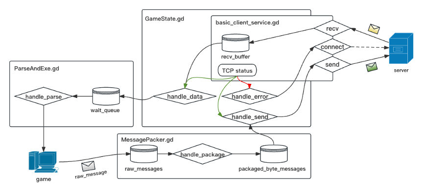
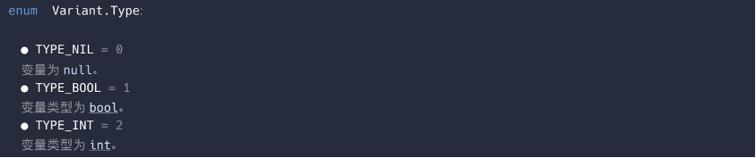
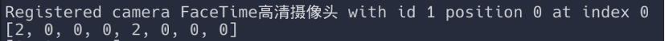
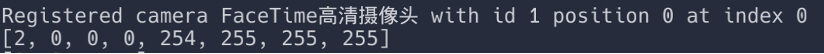

# epoll-server

a simple game server

> 注意：需要 epoll 系统调用，并没有为 drawin 上的 kqueue 或 windows 上的 IOCP 提供实现

- [epoll-server](#epoll-server)
  - [游戏介绍](#游戏介绍)
  - [关于服务器设计（软件）](#关于服务器设计软件)
    - [根据帧同步的消息交互和协议设计](#根据帧同步的消息交互和协议设计)
    - [新玩家加入游戏](#新玩家加入游戏)
    - [游戏中玩家角色状态信息同步](#游戏中玩家角色状态信息同步)
    - [玩家退出/掉线处理（半开连接-\>心跳包）](#玩家退出掉线处理半开连接-心跳包)
  - [服务器调度设计简介](#服务器调度设计简介)
    - [关于异步-固定多线程的简单代码实现](#关于异步-固定多线程的简单代码实现)
  - [关于服务器实现细节](#关于服务器实现细节)
    - [Epoll 选择边缘触发（edge-triggered）](#epoll-选择边缘触发edge-triggered)
    - [Epoll accept](#epoll-accept)
    - [Epoll read](#epoll-read)
    - [Epoll send/write](#epoll-sendwrite)
  - [read 一次读空和 write 一次写满](#read-一次读空和-write-一次写满)
    - [read 一次读 1k](#read-一次读-1k)
    - [send/write](#sendwrite)
  - [关于客户端](#关于客户端)
    - [坑其一](#坑其一)

## 游戏介绍

游戏名称：Squash the Creeps 通过 Godot engine 3.5.3 制作：


Godot Engine 是一款开源的跨平台游戏引擎，具有图形化的场景编辑器和强大的脚本语言 GDScript。由于其免费、开源、轻量级和灵活的特性，Godot 已成为游戏开发者和创作者的热门选择。它支持 2D 和 3D 游戏开发，提供丰富的功能集，包括物理引擎、动画系统、网络功能等，使得开发者能够创建各种类型的游戏和交互性应用。

**同步方式**：**状态同步**

在游戏开发中，状态同步是一种重要的技术手段，用于确保所有玩家在不同设备上看到的游戏状态保持一致。在多人在线游戏中，玩家的操作和游戏世界的变化需要在多个客户端之间实时同步，以实现流畅的游戏体验。状态同步的核心在于将游戏对象的状态（如位置、速度、生命值等）从服务器发送到所有连接的客户端。服务器通常负责管理游戏的核心逻辑，所有重要的状态更新都在服务器上处理，然后将更新的信息广播给各个客户端。这种方式确保了游戏的公平性和一致性，因为客户端不能直接操控游戏状态，只能通过服务器进行交互。为了优化性能和减少网络延迟，状态同步常采用预测和插值技术，允许客户端在接收到更新之前先进行局部预测，从而提升游戏的流畅度和响应性。通过合理设计状态同步机制，开发者可以在保证游戏公平性的同时，提高玩家的沉浸感和互动体验。

## 关于服务器设计（软件）

> 硬件为树莓派 4b： `Linux raspberrypi 6.1.0-rpi6-rpi-v8 #1 SMP PREEMPT Debian 1:6.1.58-1+rpt2 (2023-10-27) aarch64 GNU/Linux`

### 根据帧同步的消息交互和协议设计

既然服务器端只设计到转发操作，那么我们首先应该把服务器的“操作消息”以及与之搭配的“消息协议”定义出来。考虑到网络传输的效率和性能，首选的协议类型当然是二进制协议。这里的二进制协议十分简单，就是一个包含了操作消息类型和操作消息长度的结构体：

```c
// include/binary_protocol.h
// 定义消息头
typedef struct
{
    MessageType type; // 消息类型
    uint16_t length;  // 消息长度
} MessageHeader;
```

消息类型 MessageType 是一个枚举类型：

```c
typedef enum
{
    UNKWON_TYPE = 1,    // 未知类型, 用于初始化
    RESPONSE_UUID,      // 响应UUID, 用于客户端初始化自己的UUID
    GLOBAL_PLAYER_INFO, // 全局玩家信息, 用于客户端初始化其他玩家的相关信息
    SOME_ONE_JOIN,      // 有玩家加入, 用于客户端初始化其他玩家的相关信息
    SOME_ONE_QUIT,      // 有玩家退出, 用于客户端初始化其他玩家的相关信息
    GAME_UPDATE,        // 游戏更新, 用于客户端更新游戏状态
    PLAYER_INFO_CERT,   // 玩家信息认证, 用于客户端向服务器端认证玩家信息
    CLIENT_READY        // 客户端准备就绪, 用于客户端通知服务器自己已经准备就绪
} MessageType;
```

这个消息头会最后会被放在一个字节数组之中和消息体一起被发送过去，我们不妨想想这个消息体之中应该会包含哪些消息：

1. 游戏角色实例的状态信息，用于在各个客户端之中对游戏角色进行同步，包含角色所处的 x、y、z 坐标以及在 x、y、z 坐标上的旋转角度。
2. 服务器端向客户端分配全局唯一 UUID 号。
3. 客户端向服务器端响应的玩家名称。
4. 服务器端向客户端响应的所有其他玩家的相关信息，包括所有在线玩家的 UUID 和名称，用于初始化游戏。
5. 服务器端向客户端更新的新加入的玩家的 UUID 和名称。
6. 客户端向服务端发送退出游戏消息。
7. 服务器端向其他客户端广播关于此玩家退出游戏的消息。
8. 玩家信息认证, 用于客户端向服务器端认证玩家信息。
9. 客户端准备就绪, 用于客户端通知服务器自己已经准备就绪。

这里实际上不需要同步玩家的死亡消息，因为如果一个玩家在自己的视角被其它玩家踩扁了，根据帧同步的理论，其他玩家都能看到这一过程发生，所以他们都会在自己的客户端上“让这个玩家死亡”。

服务器端和客户端之间的消息交流模型图大致如下：

### 新玩家加入游戏


当新玩家加入游戏时，首先服务器端 accept 到客户端的请求之后，会响应一个 UUID 给客户端，这个 UUID 会用来区分不同的游戏玩家，所以必须要是全局唯一的，这可以通过读 Linux 操作系统下的一个文件来实现：

```shell
cat /proc/sys/kernel/random/uuid
```

> 这个命令的作用是显示系统内核参数/proc/sys/kernel/random/uuid 的值。具体而言，它用于生成并输出一个随机的 UUID（通用唯一标识符）。UUID 是一个 128 位的标识符，通常以 32 个十六进制字符的形式表示

客户端收到 UUID 响应之后会把自己的玩家昵称返回给服务器端，这是因为服务器端会维护一个**在线玩家信息表**，其中包括了一个玩家的昵称，玩家的 UUID 以及对应的 socket 文件描述符等相关信息。客户端当然也会维护一个，所以我们要将服务器端已有的所有在线玩家的状态信息都同步给这个新加入的客户端。当客户端收到并同步所有在线玩家的信息时，这意味着它已经具备了创建所有游戏玩家实例、以及收发并同步游戏角色实例状态信息的能力，这个时候，它会向服务器端发送一个“已就绪”消息，通知服务器端这个客户端已经真实可用。此时服务器端会将这个玩家的相关信息加入到**在线玩家信息表**之中，并向其它可用的客户端更新此新加入的玩家的信息。

### 游戏中玩家角色状态信息同步


由于是状态同步游戏，玩家角色状态信息的同步十分简单明了；在客户端的每一个物理帧之中（不受机器性能所带来的帧数差异影响），每一个客户端都会向服务器端同步一次当前自己所对应的角色状态信息，包括了角色的 x 轴、y 轴、z 轴坐标，以及在 x 轴、y 轴、z 轴上旋转的角度，这个信息会被服务器转发到所有其它的可用客户端上，客户端上会为每一个其它玩家游戏角色维护一个状态队列，该状态信息会被放到对应的状态队列之中，在每一个逻辑帧之中，godot 都会从对应的状态队列之中取出一个状态信息，并应用到对应的游戏角色实例上，实际上就是将游戏角色从当前的位置平滑地移动到新的位置：


上图以处于游戏中的客户端 3 为例进行了说明。注意这里也是有客户端自己对应的角色实例的消息队列，但是不会接收从服务器端发送过来的消息，该消息队列用于在每一个逻辑帧之中接收本客户端对应的角色实例状态消息，并将会从此消息队列之中取出本客户端对应角色实例的状态消息，将其发送给服务器端，按照前述过程广播给其它客户端。

### 玩家退出/掉线处理（半开连接->心跳包）

首先讲退出，当客户端正常退出时，应该向服务器端发送一个消息，通知自己将要退出，包括自己的 UUID 等相关信息。此时服务器端首先会在自己的在线玩家信息表之中删除这个玩家对应的相关信息。随后，服务器端会将这个消息广播到所有的客户端上，客户端收到此消息之后，也在自己维护的在线玩家信息表之中删除掉该玩家的相关信息。这个过程之中涉及到一些资源的释放，例如关闭 socket 文件描述符，析构消息队列等等：


实际上 TCP 连接已经帮我们做了这个通知的功能，经过测试，当关闭客户端时，Godot 会自动使用四次挥手去断开 TCP 连接，此时在服务器使用 `getsockopt` 函数的 `IPPROTO_TCP` 以及 `TCP_INTO` 获得 TCP 连接的相关信息：

```C
// 获取 TCP 连接信息
struct tcp_info tcpinfo;
socklen_t len = sizeof(tcpinfo);
if (getsockopt(events[i].data.fd, IPPROTO_TCP, TCP_INFO, &tcpinfo, &len) == -1)
{
    perror("getsockopt failed");
    return -1;
}
// 输出连接状态信息
printf("TCP Connection State: %u\n", tcpinfo.tcpi_state);
```

这个 `tcpinfo.tcpi_state` 实际上是一个枚举类型，如果大家学过 TCP 的话可以很容易发现: 这实际上就是 TCP 三次握手和四次挥手的几个状态：

```C
enum
{
    TCP_ESTABLISHED = 1,
    TCP_SYN_SENT,
    TCP_SYN_RECV,
    TCP_FIN_WAIT1,
    TCP_FIN_WAIT2,
    TCP_TIME_WAIT,
    TCP_CLOSE,
    TCP_CLOSE_WAIT,
    TCP_LAST_ACK,
    TCP_LISTEN,
    TCP_CLOSING /* now a valid state */
};
```

假如 `tcpinfo.tcpi_state` 的值是 `TCP_ESTABLISHED=1`，那么可以认为 TCP 连接没有问题。但是 `tcpinfo.tcpi_state` 的值是 `TCP_CLOSE` 或 `TCP_CLOSE_WAIT` 时，就说明客户端已经通过四次挥手断开了连接，服务器端就要 close 掉该 socket，并清理相关资源。

但是更加复杂的是要**处理掉线情况**，客户端和服务器之间没有完成四次挥手连接就突然由于某些原因断开了，导致 TCP 连接处于一种半开连接的状态，例如客户端突然断开网络连接，此时通过 `getsockopt` 获取到的 socket 信息都是无效的，服务器无法知道客户端是否断开了连接。

这时要用到心跳机制，通过定期发送小型数据包来确认两端主机或设备之间的连接是否仍然有效。TCP/IP 协议栈实际上就内嵌了一个心跳包机制，称为“keep-alive”。

KeepAlive 默认情况下是关闭的，可以被上层应用开启和关闭：`tcp_keepalive_time`: KeepAlive 的空闲时长，或者说每次正常发送心跳的周期，默认值为 7200s（2 小时）。`tcp_keepalive_intvl`: KeepAlive 探测包的发送间隔，默认值为 75s。`tcp_keepalive_probes`: 在 tcp_keepalive_time 之后，没有接收到对方确认，继续发送保活探测包次数，默认值为 9（次）:

```Shell
(base) destinyfucker@raspberrypi:~ $ cat /proc/sys/net/ipv4/tcp_keepalive_time
7200
(base) destinyfucker@raspberrypi:~ $ cat /proc/sys/net/ipv4/tcp_keepalive_intvl
75
(base) destinyfucker@raspberrypi:~ $ cat /proc/sys/net/ipv4/tcp_keepalive_probes
9
```

在 Linux 中我们可以通过修改`/etc/sysctl.conf`的全局配置后输入`sysctl -p`使其生效，当然也可以使用 `setsockopt` 函数来进行设置（这里忽略了错误处理）：

```C
setsockopt(sockfd, SOL_SOCKET, SO_KEEPALIVE, (char *)&one, sizeof(int));
setsockopt(sockfd, SOL_TCP, TCP_KEEPIDLE, (char *)&keep_idle, sizeof(int));
setsockopt(sockfd, SOL_TCP, TCP_KEEPINTVL, (char *)&keep_interval, sizeof(int));
setsockopt(sockfd, SOL_TCP, TCP_KEEPCNT, (char *)&keep_count, sizeof(int));
```

在这里 `one = 1`、`keep_idle` 设置为 60 秒，也就是说连接在 60 秒内没有任何数据往来,则进行探测；`keep_interval` 设置为 5 表示探测时发包的时间间隔为 5 秒；最后探测次数 `keep_count` 设置为 3，如果第 1 次探测包就收到响应了，则后 2 次的不再发。

> 在程序中表现为，当 tcp 检测到对端 socket 不再可用时(不能发出探测包，或探测包没有收到 ACK 的响应包)，epoll 会返回 socket 可读,并且在 read 时返回 `-1`,同时置上 errno 为 ETIMEDOUT.

## 服务器调度设计简介

根据上面我们说的消息交互和协议设计，实际上有多种服务器调度设计方案可以选择：

a. **同步-动态多线程**：每接收一个用户会话，就建立一个线程。这个用户会话往往就是由客户端的 TCP 连接来代表，这样每次从 socket 中调用读取或写出数据包的时候，都可以使用阻塞模式，编码直观而简单。有多少个游戏客户端的连接，就有多少个线程。但是这个方案也有很明显的缺点，就是服务器容易产生大量的线程，这对于内存占用不好控制，同时线程切换也会造成 CPU 的性能损失。更重要的多线程下对同一块数据的读写，需要处理锁的问题，这可能让代码变的非常复杂，造成各种死锁的 BUG，影响服务器的稳定性。

b. **同步-多线程池**：为了节约线程的建立和释放，建立了一个线程池。每个用户会话建立的时候，向线程池申请处理线程的使用。在用户会话结束的时候，线程不退出，而是向线程池“释放”对此线程的使用。线程池能很好的控制线程数量，可以防止用户暴涨下对服务器造成的连接冲击，形成一种排队进入的机制。但是线程池本身的实现比较复杂，而“申请”、“施放”线程的调用规则需要严格遵守，否则会出现线程泄露，耗尽线程池，对于这种方案的实现需要斟酌。

c. **异步-单线程**：实际上在游戏行业中，采用 Linux 的 epoll 作为网络 API，以期得到高性能，是一个常见的选择。游戏服务器进程中最常见的阻塞调用就是网路 IO，因此在采用 epoll 之后，整个服务器进程就可能变得完全没有阻塞调用，这样只需要一个线程即可。这彻底解决了多线程的锁问题，而且也简化了对于并发编程的难度。但是，“所有调用都不得阻塞”的约束，并不是那么容易遵守的，总会有一些需要进行阻塞的 API，一旦阻塞，其它用户的请求就会得不到处理，这对游戏体验的影响毫无疑问地非常大；另外单进程单线程只能使用一个 CPU，在现在多核多 CPU 的服务器情况下，不能充分利用 CPU 资源；最后，异步编程由于是基于“回调”的方式，会导致要定义很多回调函数，并且把一个流程里面的逻辑，分别写在多个不同的回调函数里面，这对于代码阅读和编写也会产生不利。

---

**试试异步-固定多线程?**

综上所述，我最后为服务器选择的是“**异步-固定多线程**”调度模型，这是基于异步-单线程模型进化出来的一种模型。这种模型一般有三类线程：主线程、IO 线程、逻辑线程。这些线程都在内部以全异步的方式运行，而他们之间通过无锁消息队列通信。

这种架构继承了异步-单线程模型的性能优势，同时解决了一些其局限性。在异步-单线程模型中，由于只有一个线程，无法充分利用多核多 CPU 的服务器资源。而在异步-固定多线程中，通过引入 IO 线程和逻辑线程，能够更好地利用多核处理器，提高整体性能。


此外，采用固定的线程数量可以避免异步-单线程模型中线程数量动态增加导致的内存占用问题。相比于同步-动态多线程和同步-多线程池的方式，这种模型能更好地控制线程数量，避免线程泄露和线程池耗尽的情况，从而提高服务器的稳定性。

### 关于异步-固定多线程的简单代码实现

大概来说设计要点如下：

主函数中做一些全局初始化的准备，新建 3 个子线程分别去建立连接/接收请求，处理请求，发送请求。会初始化 2 个 epoll 来分别监听可以写数据（发送请求）的事件和可以读数据（接收请求）的事件。

使用一个结构体 query 来代表服务器和客户端通信的消息单元：

```C
// in include/query.h
typedef struct _CQuery
{
    MessageHeader m_header; // 消息头
    int m_socket_fd;        // socket fd

    char m_byte_Query[QUERY_BUFFER_LEN]; // 携带的数据
    uint16_t m_query_len;                //  query长度
    struct _CQuery *p_pre_query;         // 上一个req
    struct _CQuery *p_next_query;        // 下一个req
} CQuery;
```

其中 `socket` 句柄代表的是这个消息是从哪个客户端发出的；`m_byte_Query` 记录了字节形式的消息；`LOAD_LENGTH` 可以根据实际的消息大小来进行调节；`m_query_len` 之中记录了 `m_byte_Query` 的有效长度，这在打包数据的时候十分有用；最后，`m_state` 跟踪了目前该 query 所处的状态（接收、处理或发送），主要用于 debug 阶段。

query 在服务器之中主要被组织于 3 个双链表（消息队列）之中：它们分别表示空闲队列 `freeList`，等待处理队列 `readyList`，和发送队列 `workList`，这 3 个队列会被多线程操作，故使用共享锁来排斥性访问。

之所以使用双链表结构是便于处理 epoll 事件时，直接将 query 切换队列，而无需去遍历。

**让三个消息队列进行轮转**:

接收请求子线程会循环等待 `recv_epoll` 上发生的读事件，`accept` 客户端连接请求或将从客户端发送过来的数据包装成一个个 `CQuery`，并将其放入 `readyList` 之中等待处理子线程处理。这里的 `CQuery` 并不是即时创建的，而是从 `freeList` 之中 `pop` 出来的，**这样就可以控制整个服务器的内存占用大小和负载能力**，只需要改变 `freeList` 的长度即可。相应的，当 `CQuery` 被发送完之后，会被重新装填回 `freeList` 之中，形成一个循环。

处理子线程会从 readyList 之中 pop 出 CQuery 并进行处理，这里实际上就是对消息类型的一个 switch-case 判断，根据不同的消息类型选择不同的函数进行处理（打包数据）：

-   对于消息类型 RESPONSE_UUID，服务器会生成一个 UUID 并将其和消息头一起打包到 CQuery 的 m_byte_Query 之中（实际上处理子线程干的就是这个，将要发送的数据准备好，并将其和消息头一起打包到 m_byte_Query 之中）
-   对于消息类型 GLOBAL_PLAYER_INFO，服务器会把在线玩家信息表之中的所有玩家相关信息（玩家 ID 和昵称）和其消息头打包到 m_byte_Query 之中。
-   当然更多的还是对游戏状态的转发操作，像是 SOME_ONE_JOIN、SOME_ONE_QUIT 和 GAME_UPDATE，这些消息类型的 m_byte_Query 之中已经拥有了完整的消息头和数据信息（由客户端打包发过来的）所以我们不用进行处理。SOME_ONE_JOIN 是一个特殊情况，因为这是服务器端在接收到客户端的 CLIENT_READY 消息时，准备向所有其它在线客户端广播此玩家信息的行为，这还是会涉及到对新加入玩家信息的再次打包的操作。
-   最后，当一个 CQuery 被打包好之后（对于转发操作则不用打包），它会被放入 workList 之中等待发送。

发送请求子线程会循环等待 send_epoll 上发生的写事件，并处理在 workList 之中的 query 类，发送请求。请求发送成功后，将该 query 放回到 freeList 之中。


## 关于服务器实现细节

### Epoll 选择边缘触发（edge-triggered）

Epoll 有两种触发方式：边缘触发(edge-triggered)水平触发(Level-triggered)，水平触发是只要读缓冲区有数据，就会一直触发可读信号，而边缘触发仅仅在空变为非空的时候通知一次。关于为什么要使用边缘触发（实际上只有采用边缘触发才能实现高性能），我接下来会从一个服务器的三个必要功能 accept、read、send 的实现角度来分别进行阐述。

### Epoll accept

首先是 accept 的场景：如果使用水平触发，每次触发只调用一次 IO 时，一次只能 accept 一个连接请求，那么需要不断的连接请求触发，才能继续 accept 连接，效率非常低。但是使用了边缘触发+while 循环遍历直至数据为空之后，同样的情况下，服务器能接收全部的连接请求，其原因就是一次触发就可以处理该次触发所接收的所有连接请求，大大减少了 epoll_wait 系统调用，减小了内核资源消耗，代码实现如下（详见 `query.c` 下的 `CQuery_accept_tcp_connect` 函数）：

```C
// 尝试接受来自客户端的新连接，保存到query->m_socket_fd中
// 如果失败，检查错误类型：资源临时不可用（EAGAIN或EWOULDBLOCK）或其他错误
if (0 > (query->m_socket_fd = accept(listen_socket, (struct sockaddr *)&addr, &addrlen)))
{
    // 如果是EAGAIN或EWOULDBLOCK错误，表明资源暂时不可用，将query返回到空闲列表并返回错误码
    if (EAGAIN == errno || EWOULDBLOCK == errno)
    {
        add_free_list(query);
        return RESOURCE_TEMPOREARILY_UNAVAILABLE;
    }
    else
    {
        // 如果是其他错误，关闭连接，返回到空闲列表，并返回套接字接受错误
        CQuery_close_socket(query);
        add_free_list(query);
        return SOCKET_ACCEPT_ERROR;
    }
}
```

这里的第一个参数 `listen_socket` 是服务器 bind 并 listen 的 socket，在程序主体流程之中，整个数都会以这样的形式来调用：

```C
while (0 == (result = CQuery_accept_tcp_connect(g_pconf->listen_socket))) {
    if (result < 0 && result != RESOURCE_TEMPOREARILY_UNAVAILABLE) {
        // ……相关错误判断和处理
    }
}
```

一旦触发，就使用 while 循环读到空为止。

### Epoll read

假设我们处于接收数据 read(socket_fd)的场景下，水平触发是只要读缓冲区有数据，就会一直触发可读信号，而边缘触发仅仅在空变为非空的时候通知一次。所以假如使用水平触发的话，就很容易设计成一次只向文件缓冲区之中读/写一条数据的情况，而且要不断进行 epoll_wait 和 read，这也就意味着当数据较大时，需要不断从用户态和内核态切换，消耗了大量的系统资源，影响服务器性能。所以在本项目之中使用边缘触发进行实现，只用触发一次 epoll_wait，就可以通过 while 循环读取缓冲区的所有数据，这对于实现服务器高性能是非常有帮助的。

### Epoll send/write

对于 send / write 来说，实际上并不需要像 read 一样一开始就直接依靠 `EPOLLOUT` 触发来进行调用，以保证高性能。如果要 send / write 那么就直接调用, 如果返回值 > 0, 证明数据已经复制到发送缓冲区中，一切正常。如果 send / write 返回 < 0 且 `errno == EAGAIN`，此时说明发送缓冲区满了。那么需要把剩余的字节保存起来，然后注册上 `EPOLLOUT` , 直到 epoll_wait 返回 , 说明发送缓冲区可写, 再把之前保存起来的数据发送,如果此时 write 返回 > 0 那就把 `EPOLLOUT` 取消掉即可。

综上所述，使用边缘触发的 Epoll 来对 receive、accept、send 进行 io 多路复用处理是十分可行的，在这种模式下，socket 必须要被设置为非阻塞模式：

```C
int setnonblocking(int sockfd)
{
    // 实现设置 sockfd 为非阻塞模式的代码

    int opts;
    opts = fcntl(sockfd, F_GETFL, 0);
    if (opts < 0)
    {
        perror("fcntl(sock,GETFL)");
        return -1;
    }
    opts = opts | O_NONBLOCK;
    if (fcntl(sockfd, F_SETFL, opts) < 0)
    {
        perror("fcntl(sock,SETFL,opts)");
        return -1;
    }
}
```

## read 一次读空和 write 一次写满

使用边缘触发的 epoll 还有一个非常重要的细节要处理：read 要一次读空，write 要一次写满，这就是减少 epoll_wait 调用次数的代价：epoll 在使用边缘触发时只有在 socket 状态改变时才会得到通知（由空转化为非空或由满转化为非满），这也就意味着如果在一次操作中失误，没有读空/写满的话之后在 epoll_wait 就无法跟踪到该 socketfd 了，**游戏就会卡死**。

刚刚只说了对 accept 的一次读空，因为 accept 函数解决了大部分的事情，例如操作缓冲区和处理连接队列，而且数据比较简单：都是单一的连接请求，不用去考虑此次如果读/写资源暂时不可用的话对应的异常处理情况。

### read 一次读 1k

对于 read 来说有两种解决方案，第一种就是一次读一个 `prepare_to_read` 长度的数据，`prepare_to_read` 的值随着运行改变，等于 `header` 的长度或者 `header` 之中存储的数据体的长度。采用这种方案基本上就是先读一个 `header` 长度的数据，然后将其从比特数组解析为 `header` 结构体，取出其中包含的数据体长度 length 并将其设置为下一次应该读取的长度。

这种方案看似挺好，实际上通过实验发现是不可行的，首先就是性能肯定会收到影响，一次 `epoll_wait` 会涉及到非常非常多的 `read` 系统调用，切换内核态和用户态的性能损耗绝对不能忽略不计。其次就是一次读的数据量太小了，一个 `header` 是 8 个字节，而数据体的大小不可能超过 200 个字节，socket 是一种全双工的通信方式，服务器在读端读取数据的时候客户端仍然可以在写端写入数据，这就好像是一个水池的装水和放水问题，如果一次读取的数据量太小的话，从该 socket 之中 read 就很难读空进入到 `EAGAIN` 的状态，从而退出对此 socket 的读取，进入到对下一个 socket 的读取之中，这意味着其它客户端就会得不到处理，这对游戏体验的影响还是很大的。

我们希望的是可以在一次 `epoll_wait` 之中可以快速轮询待处理 `socket` 之中已经到达的数据，而且尽量减少对 `read` 的系统调用：解决方案是我们一次读 **1k** 的数据到缓冲区之中，这样便很容易读出 `EGAIN`，退出 read 的 while 循环，然后再在用户态之中着手对于已读取到的数据的处理。还有一点，因为基于 TCP 的 socket 是流式传输，所以我们并不能确定在退出 read 时是否缓冲区之中都是完整的数据包（指的是消息头和数据部分都是完整的，可能最后一个数据包就只传输了一半过来），这涉及到一些额外的处理。为了方便理解我的实现，下面是一段测试代码：

```C
// int CQuery_recv_message(int socketfd)
// in query.c
// 和源代码细节不同，但设计思想一致
MessageHeader* header;
char* buf = // init...
while (0 < (read_byte = read(events[i].data.fd, buf + havent_handle, UNIT_BUFFER_SIZE)))
    havent_handle += read_byte;
if (EAGAIN == errno || EWOULDBLOCK == errno) {
    while (prepare_to_handle <= havent_handle) {
        if (is_header_handle) {
            memmove(id, buf, 36);
            id[37] = '\0';
            memmove(player_name, buf + 36, prepare_to_handle - 36);
            player_name[prepare_to_handle - 36] = '\0';

            printf("Client: id: %s, player_name: %s\n", id, player_name);

            is_header_handle = false;
            have_handle = prepare_to_handle;
            prepare_to_handle = header_size;

            free(header)
        } else {
            header = (MessageHeader *)malloc(header_size);
            memmove(header, buf, header_size);
            printf("messagetype: %d, messagelength: %d\n", header->type, header->length);
            is_header_handle = true;
            have_handle = header_size;
            prepare_to_handle = header->length;
        }

        memmove(buf, buf + have_handle, havent_handle - have_handle);
        havent_handle -= have_handle;
        printf("have_handle: %d, havent_handle: %d\n\n", have_handle, havent_handle);
    }
} else if (-1 == read_byte) {
    printf("read error: %d\n\n", errno);
    return SOCKET_ACCEPT_ERROR;
}
```

首先可以看到如果一个 socket 文件描述符被 epoll 通知，服务器首先会使用一个 while 循环来从 socket 中读取数据到缓冲区之中，一次读 `UNIT_BUFFER_SIZE` 个字节，这个宏一般设置为 1024，同时还有一个 int 类型的变量 `havent_handle` 来记录缓冲区之中有多少有效数据，在每一个循环之中加上本循环之中读取到的数据量 `read_byte`。这个有效数据也有另外一层含义：“未处理的数据”，所以这个变量不止是记录有多少有效数据那么简单，这个后面再说。

假如 `read_byte < 0`，说明此时 read 函数触发了错误，有可能是读空了资源暂时不可用（`EAGAIN`），也有可能是什么其它致命性错误，所以这里需要根据 errno 之中的信息做一个判断。如果是 EAGAIN 或 EWOULDBLOCK，那么就表示确实读空了，开始对缓冲区之中已经读到的数据进行处理，将其拆成一个个 CQuery，在这段测试代码之中我就是简单地从缓冲区之中解析出 header，并根据 header 之中的信息解析出数据体，并将它们打印出来查看效果。

处理部分用到了 `memmove` 来对缓冲区之中的字节进行处理，`memmove` 的性能和 `memcopy` 差不多，会稍微差一点，但是比 `memcopy` 会更加安全。这是一个 while 循环，在每一个循环之中首先根据一个 bool 类型的变量 `is_header_handle` 来查看 header 是否已经被解析，因为只有解析了 header 我们才知道该消息的类型是什么，长度是什么。

如果没有解析 header 的话，就先对 header 进行解析，从缓冲区之中 `memmove` 出一个 header 长度的字节到在堆上分配的 header 内存之中，这个长度是固定的，在本架构设计之中是 8，准备从缓冲区之中获得的数据量实际上存储在一个变量 `prepare_to_handle` 之中，在处理完 header 之后，`prepare_to_handle` 会被设置为 header 之中存储的数据体的长度，同时 `is_header_handle` 会被设置成 true，表示接下来应该处理数据体了，处理数据体也是这么个逻辑，memmove prepare_to_handle 个字节到对应的缓冲区之中，这里不再赘述。

在每一个循环之中，都会有一个变量 `have_handle` 记录在这个循环之中处理了多少个字节的数据，在循环末尾，`havent_handle` 会减去 `have_handle`，表示这么多个字节已经被处理完成，同时通过 memmove 函数将这部分的字节移除出去。

关于循环条件 prepare_to_handle <= havent_handle 这样设计有一个好处：假如由于网络等原因，客户端只读到了一部分的数据包，这个截断有可能发生在任何的地方：消息头和数据体，当这种情况发生时无论是消息头还是数据体，prepare_to_handle 都会小于 havent_handle，这样就会退出循环，prepare_to_handle、is_header_handle、havent_handle 都会被保存下来，等待下次 epoll_wait 条件满足时继续进行处理，并不会有什么冲突问题。

### send/write

对于 write 来说，实际上在服务器实现细节之中就有有关的介绍，这里我们直接来看实例代码（send_req.c），代码有点长，这里我就不粘贴了，直接进行解释：
在这个.c 文件之中，主要实现了三个函数：`send_req_main`、`handle_group_send`、`handle_send`

`send_req_main` 函数是一个线程的主函数，它在一个循环中等待事件，不断处理待发送的数据。它主要包括两个部分：

-   **第一部分：非阻塞写入（Non-blocking Write）**

当 `g_is_write_eagain` 为真时，通过 `epoll_wait` 等待就绪的事件，然后遍历处理就绪的事件。对于每个就绪的套接字，通过 `write` 函数尽可能地将数据发送出去，处理写入完成的情况，以及处理 `EAGAIN` 或 `EWOULDBLOCK` 错误。如果有数据还未发送完，将未发送完的数据移动到相应的 `player_info` 结构中的缓冲区,如果写入全部完成，将 `g_is_write_eagain` 置为假。

-   **第二部分：处理客户端发来的数据**

通过 get_gwork_query 函数获取待发送的数据包。根据数据包之中消息头的类型，分别调用 handle_group_send 或 handle_send 函数进行处理。
在 handle_group_send 函数中，首先获取了所有玩家的套接字，然后遍历这些套接字，对每个套接字调用 handle_send 函数发送数据。注意，发送数据的源套接字是不参与发送的，从而实现广播功能。

handle_send 函数是实际处理数据发送的函数。首先，它会尝试直接将数据写入套接字。如果数据全部发送成功，那么函数就结束了。如果数据没有全部发送成功（可能是因为网络缓冲区已满），那么它会将剩余的数据保存到对应的 player_info 结构体的 snd_buffer 中，并将套接字注册到 epoll 中，等待下一次可写事件。当在 send_req_main 之中 epoll_wait 报告这个套接字可写时，就会再次尝试发送 snd_buffer 中的数据。

这里有一个细节要说一下：假如目标客户端的套接字被挂到了 send_epoll 上，handle_send 调用是不能直接向目标客户端发送数据的，如果直接进行发送，就会造成数据错位。此时应该转为将要发送的数据写入到目标客户端对应的缓冲区之中，等待 epoll_wait 再进行发送。

## 关于客户端

网络通信部分使用的是 godot 的官方脚本语言 GDScript 进行编写，由于和使用系统调用编写服务器相关知识相去甚远，这里我就简单说明设计的架构和网络通信部分的实现。

GDScript 的底层有一个叫做 `StreamPeerTCP` 的类，通过该类可以建立一个 TCP 流并可以获取 TCP 流的当前状态，`StreamPeerTCP` 继承了另外一个名为 `StreamPeer` 的类，该类提供了从 TCP 流读出数据和向 TCP 流写入数据的 API。

有了这些东西我们就可以编写一个基本 client 服务脚本（脚本实际上就是 GDScript 之中的类）作为整个网络通信部分的支撑（位于客户端文件夹下的 `Net/basic_client_service.gd` 中），该脚本之中实例化了一个 StreamPeerTCP 类，提供建立 tcp 连接，send 字节和 recv 字节的功能，并在游戏的每一帧之中监控 TCP 连接的状态，观察是否有服务器发送的数据到达。

Godot 秉承一种万物皆“节点”的思想，一个脚本可以是一个节点，一个玩家实例也可以是一个节点。节点和节点之间通过一个叫做“信号”的东西进行通信，信号可以带参数，所以当我们通过 GDScript 提供的 API 发现有数据可读时，就会把数据读到一个缓冲区之中，然后发出一个信号，提醒上层组件进行处理。

这个上层组件也是一个脚本，名为 `GameState.gd`，它被设置为一个全局脚本，这和全局变量的意思差不多，可以在任意脚本之中访问该全局脚本之中定义的数据结构和函数，该脚本负责管理当前游戏的全局信息和高级的网络通信功能，它提供了超时重连、错误处理、发送数据包、接收并解析数据包的功能。

和服务器很像，客户端也有几个消息队列，分别为 `recv_buffer`、`wait_queue`、`raw_messages`、`packged_byte_messages`。

`recv_buffer` 是一个字节缓冲区，通过底层 `StreamPeerTCP` 读取到的字节数据会放到这个字节缓冲区之中，`GameState` 会从这个字节缓冲区之中解析出数据包，并将其放到 `wait_queue` 之中，等待另一个全局脚本 `ParseAndExe.gd` 的处理。数据包类似一个 Python 字典，有“type”、“length”和“data”这几个字段，处理过程是一个对于数据包“type”字段的 switch-case，可能涉及到回传昵称，添加玩家，删除玩家和更新游戏状态等操作。

而 `raw_messages` 队列和 `packged_byte_messages` 队列则归另一个全局脚本 MessagePacker.gd 管理，raw_messages 之中存放的都是原始的数据字典，有“type”、“length”和“data”这几个字段，当游戏过程中要发送什么到服务器，客户端就会先生成一个这种字典，然后将其加入到 raw_messages 队列之中，全局脚本 MessagePacker.gd 所做的就是将 raw_messages 之中的原始数据都包装成一个个字节数组（在 GDScript 之中有一个专门的数据结构叫做 PoolByteArray 用来保存和处理字节数据），放到 packaged_byte_messages 之中，同时还会发送一个信号，通知 GameState 将 packaged_byte_messages 之中的所有字节数据都发送到服务器端。



只有在 basic_client_service.gd 之中监听到 TCP 连接是“STATUS_CONNECTED”状态（图中绿色箭头）时，才会进行 handle_data 或 handle_send 操作，否则进入 handle_error 操作（图中红色箭头），在此操作之中通常都会尝试在一小段时间之后重新连接服务器。

### 坑其一

在 GDScript 编写的客户端逻辑和 c 语言编写的服务器进行网络通信的过程之中，实际上还要克服一个数据结构不一致的问题：在客户端和服务器之中都需要有一个枚举体来代表消息类型，枚举成员的数据类型都是 int 没错，但是在 GDScript 之中只有 int64，是使用八个字节来存储的，在 C 语言之中枚举成员是 int32，使用四个字节来进行存储。在消息头之中用于保存数据包长度的 length 字段也面临这个问题，length 在 GDScript 之中是 int64，在 C 语言之中是 uint16_t。

由于在 C 语言结构体的内存对齐机制，一个消息头 uint16_t + int32 实际上占用 8 个字节，所以客户端向服务器发送数据包的消息头时，需要一次发送 8 个字节，前 4 个字节代表消息类型，后四个字节代表数据长度。查阅 GDScript 文档之后发现，由于它是一门动态类型的语言，所以其变量都被抽象成了一个基类“Variant”，在内存之中会花费额外的空间来记录该变量的类型，其中 int 的类型就是 2：



通过 GDScript 函数 var2bytes 可以查看一个变量的字节表示，通过打印 int 2 和 int -2 的字节表示可以发现：





实际上在 GDScript 之中 int 类型变量的前四位是用来表示该变量的类型是 int，后四位使用补码来表示整数，和 C 语言之中的 int32 没有什么区别。

这样一来我们只要在客户端向服务器发送数据时把前四位截断，并在客户端从服务器接收数据时加上前四位之后进行解析即可，GDScript 都提供了相应的方法。
